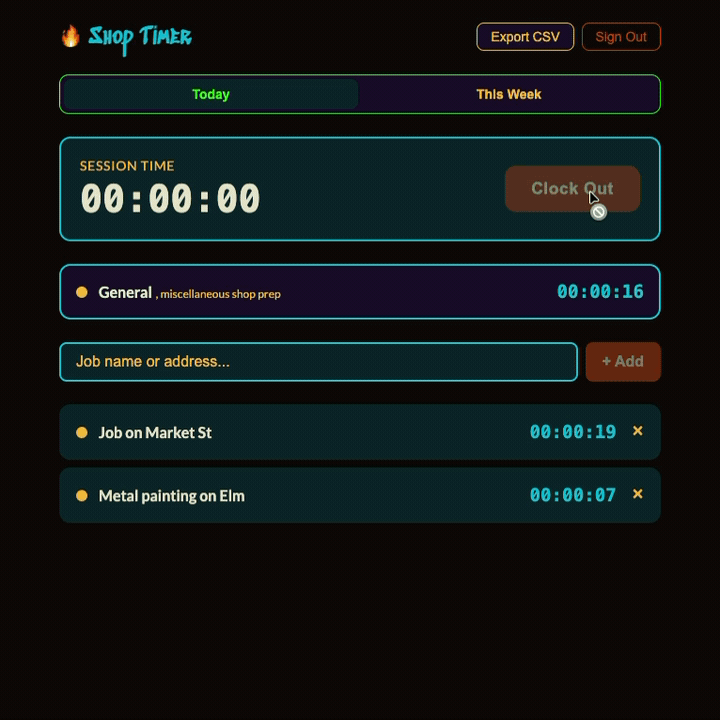

# ⚙️ Shop Timer

Time tracking for shops that bill by the job. Clock in, tap a job to start its
timer, export hours as CSV for invoicing.

Built for a metal working shop, but it fits anyone who needs to allocate hours
across clients, trades, studios, freelancers, repair work.



---

## What it does

- **Clock in / out** for the whole work session
- **Tap a job** to start its timer, tapping another stops the first automatically
- **General time** accrues whenever you're clocked in but not on a specific job:
  shop cleanup, admin, anything unbilled
- **Today** and **This week** views, with week boundaries in *your shop's*
  timezone rather than the device's
- **Export CSV** for invoicing, or share a weekly summary by email or text

Self-hosted: one deployment serves one shop, on your own Supabase project.
Your data stays in your database.

---

## Quick start

**1. Create a Supabase project** at [supabase.com](https://supabase.com) (free
tier is fine).

**2. Set up the database.** In the dashboard, open **SQL Editor**, paste the
contents of [`supabase/schema.sql`](supabase/schema.sql), and run it. This
creates the tables, indexes, row-level security policies, and the General job.

**3. Lock down authentication.** This is not optional, see
[Security](#security) below.

- **Authentication → Sign In / Providers** → turn **off** email sign-ups
- **Authentication → Users** → **Add user** → create your shop's login

**4. Configure and run.**

```bash
git clone https://github.com/stephvarga/shop-timer.git
cd shop-timer
pnpm install
cp .env.example .env.local   # then fill it in, see Configuration
pnpm dev
```

Open [http://localhost:5173](http://localhost:5173) and sign in with the user
you created.

---

## Configuration

`.env.local`:

| Variable | Required | What it is |
|---|---|---|
| `VITE_SUPABASE_URL` | yes | Settings → Data API → Project URL |
| `VITE_SUPABASE_ANON_KEY` | yes | Settings → API Keys → **Publishable** key |
| `VITE_SHOP_TZ` | no | IANA timezone for the shop. Defaults to `America/Los_Angeles`. Use a full name like `America/Chicago`, not `CST`. |

The publishable key ships in the browser bundle and is meant to be public.
Row-level security is what protects your data. Never put a `service_role` key
in `.env.local`.

Vite only reads `.env` files at startup, restart the dev server after editing.

---

## Security

**One shared account per deployment.** Row-level security grants every
signed-in user access to all jobs and all hours. That's the right model for a
single shop, and it means everything depends on strangers being unable to
create accounts.

**If you leave public sign-ups enabled, anyone who finds your deployed URL can
register and read your entire billing history.** There is no second line of
defence. Turn them off (step 3 above) and create users by hand.

Beyond that:

- `supabase/schema.sql` enables RLS on every table, don't disable it
- `vercel.json` ships a Content-Security-Policy, HSTS, and frame-blocking
  headers. Test on a preview deploy before production; a too-strict CSP will
  white-screen the app
- `pnpm healthcheck` verifies RLS with a differential test, it confirms an
  anonymous client sees nothing while a signed-in one sees your data

---

## Notable engineering

The interesting problem here wasn't building the timer, it was a bug that
quietly deleted work.

Hours were disappearing. The cause was date boundaries computed in UTC against
Pacific-time data: `new Date().toISOString().slice(0, 10)` returns the *UTC*
date, so from 5pm Pacific onward the app queried **tomorrow** and the whole
day's tracked time dropped out of the view. Every evening. The week query had
the same bug plus a mutation of its own input, which silently dropped Mondays.

The response is in [`src/time.ts`](src/time.ts) and
[`src/time.test.ts`](src/time.test.ts): all boundaries pinned to a configured
IANA zone with DST-safe two-pass offset resolution, and a suite that sweeps
every hour of a full week and every hour of a month spanning a DST transition,
asserting each time that the window actually contains the moment in question.
It runs green under four different system timezones, because a date test that
only passes on the author's machine proves nothing.

Related work in the same vein:

- **[`scripts/audit.mjs`](scripts/audit.mjs)**: a read-only healthcheck that
  answers what the UI can't: is the project reachable, is RLS actually
  enforcing, is any time stranded in entries that never closed, and do the
  database totals match what's on screen
- **Orphan recovery**: entries left open by a crash are closed using their
  parent session's clock-out instead of being silently discarded
- **Error surfacing**: a failed load used to render as "No jobs yet", which is
  indistinguishable from an empty list. That ambiguity is how hours go missing
  without anyone noticing
- **[`QA.md`](QA.md)**: how to test this without using it for a week

---

## Scripts

| Command | What it does |
|---|---|
| `pnpm dev` | Dev server |
| `pnpm build` | Typecheck and production build |
| `pnpm verify` | Typecheck + lint + tests |
| `pnpm test` | Tests only |
| `pnpm test:tz` | Tests under UTC, Tokyo and New York |
| `pnpm healthcheck` | Live database check (prompts for your app login) |

---

## Deploying

Any static host works. On Vercel, `vercel.json` applies the security headers
automatically, set the three `VITE_*` variables in the project's environment
settings, and remember that the free Supabase tier pauses a project after about
a week of inactivity (a pause freezes your data, it doesn't delete it).

The free tier also keeps **zero backups**. If you're billing real clients from
this, take periodic dumps:

```bash
pg_dump "$SUPABASE_DB_URL" > backup-$(date +%F).sql
```

---

## Tech stack

React 19 · TypeScript · Vite · CSS Modules · Supabase (Postgres + Auth) · Vitest

## License

MIT, see [LICENSE](LICENSE).

Personal shell and git setup lives in [docs/dev-setup.md](docs/dev-setup.md).
